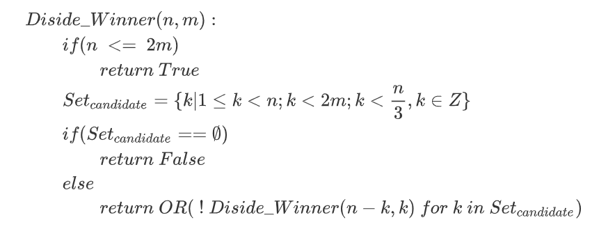

# a两人取石问题

### 一 题目描述

有两个玩家，一堆数量为`n`的石头。两人按照如下规则取石头：

- 第一次取石头的数量范围为 `[1,n)`
- 每次取石头的数量范围为 `[1,2m)`，其中`m`为对方上一次取的石头数量

证明这个游戏有必胜的算法。（等价于：最后胜出者是谁仅与`n`有关）

### 二 问题思考

- 开始时，大致认为思路可以从**递归**出发，最后问题会化归为一定数量的子问题。

- 后来在枚举几种`n`较小的情况后发现，其递归模式并非一定落入完全相同的子问题中，原因是当由于前面取石块导致落入剩下`n`个石头的情况与最开始有`n`个石头的情况并不相同：根据取石规则2，取石约束是不同的。

- 最后认为，如果仅需要一个 `n -->[f]--> who win`的函数`f`，该函数可以利用递归来构造，而递归的结构应当是这样的：

  - 当轮到某一人取石头时，根据约束条件筛选本次可以取的石头数量的候选集
  - 若候选集为空，则返回 `False`（即当前做选择的选手输）
  - 若候选集不为空，则递归检查所有候选集导致的子情况；若有一个子情况返回` True`，则返回 `True`（当前选手获胜）

  具体伪代码见章节四。

- 若证明此结论，应使用数学归纳法，见章节三。

### 三 证明

该问题与**Fibonacci数列**有一定的关系。

- **提出结论：**当石头数 `n = F(n)`，其中 `F(n)`为Fibonacci数列时先手输；其余情况先手赢。

- **归纳起点：**显然当 `n = 2,3`时，该结论成立（`n=1`时游戏无法进行）

- **归纳递推：**假设`n = F(k)`时结论成立（后手赢）。

  - 先证明当 `n = F(k)+i < F(k+1)`时先手能赢。此时有 `i < F(k+1) - F(k) = F(k-1)`。
    - 若 `i <= F(k-2)`，则先手取 `i`个石头，剩下 `F(k)`个石头显然大于`2i`，后手无法一次取完，根据假设，先手赢（此时先手为这次决策的后手）；
    - 若 `F(k-2) < i < F(k-1)`，则先手的策略是先取`i-F(k-2)`，再让后手取`F(k-2)`。其中，若 `i-F(k-2)`为Fibonacci数则最大为 `F(k-4)`，再轮到先手时可以一次性取完（因为`2*F(k-4) < F(k-2)`）；若不是Fibonacci数，由假设可知最终也将由先手取完。

  - 若`i = F(k-1)`，此时 `n = F(k+1)`。先手进行**最佳决策**，则必须保证第一次至少拿`F(k-1)`（因为根据前面的证明，后手落入上面情况的先手局，则必胜），而根据规则，此时后手最多能拿 `2*F(k-1) > F(k-1)+F(k-2) = F(k)`个石头，因此后手可以一次性拿完，此时先手必输。

  证毕。（来源： http://ddrv.cn/a/146517 ）

### 四 递归法求解

根据题意，我们可以得到以下递归函数：

